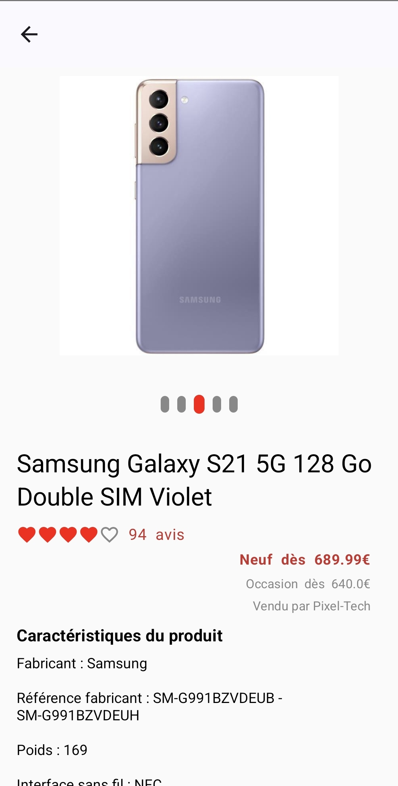
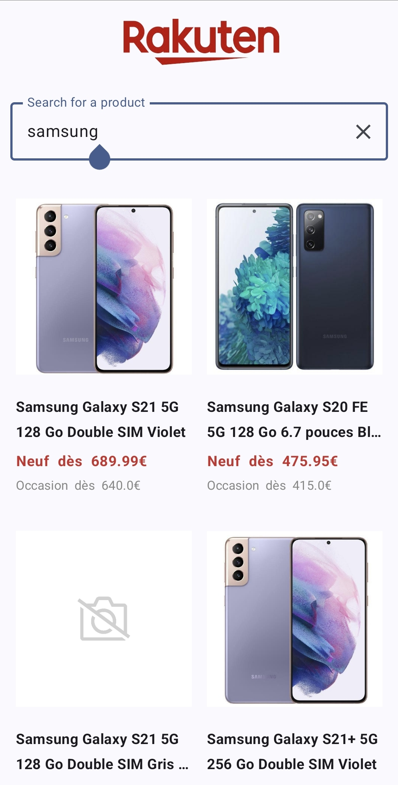
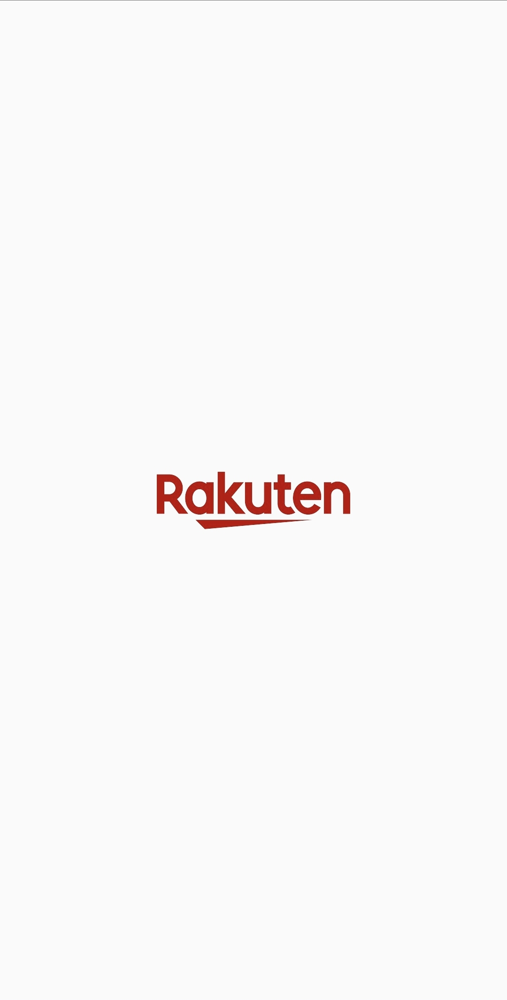

# 🛒 E-Commerce App  - Search Rakuten 

An Android application that allows users to browse and interact with a list of products via a web service.  

## 📌 Features  

✅ **Product Listing** – Fetch and display a list of products from a web service.  
✅ **Product Details** – View product details, including price, reviews, comments, and description.  

## 🛠 Tech Stack  

### 📐 Architecture & Design Patterns  
- 🏗 **Clean Architecture** – Separation of concerns for better maintainability.  
- 🎭 **MVVM (Model-View-ViewModel)** – Improved UI state management.  
- 🛠 **Hilt** – Dependency injection for efficient management.  

### 💻 Development  
- 🌐 **Retrofit** – Handles API calls.  
- 🗄 **Room** – Local database for data persistence.  
- 🎨 **Jetpack Compose** – Modern UI toolkit.  
- 🖼 **Coil** – Fast image loading and caching.  

### ⚡ Asynchronous Processing  
- 🔄 **Coroutines** – Smooth asynchronous operations.  
- 🔥 **Flow** – Reactive data streams.  

### ✅ Testing & QA  
- 🧪 **Mockito** – Mock dependencies for unit testing.  
- 📜 **Cucumber** – Behavior-driven testing (BDD).  

### 🚀 CI/CD  
- 🔄 **GitHub Actions** – Automates builds, tests, and deployment.  
- 🔧 **Pipeline** – Streamlines development workflow.  

### 🧭 Navigation  
- 🔗 **Navigation Component** – Intuitive and structured app navigation.  

### Screenshots 

<p align="center">



</p>

## 🚀 Installation  

### 1️⃣ Clone the repository  
```sh
git clone <repository-url>
cd e-commerce-app

